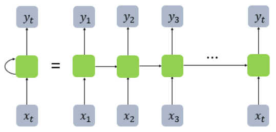
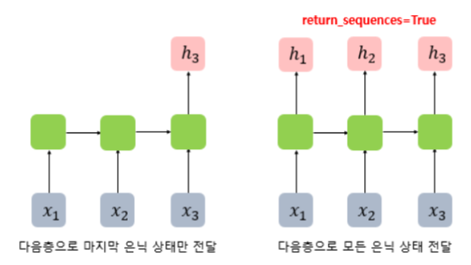
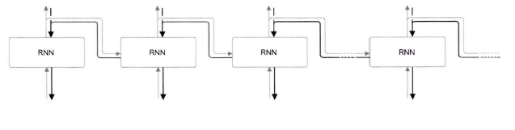
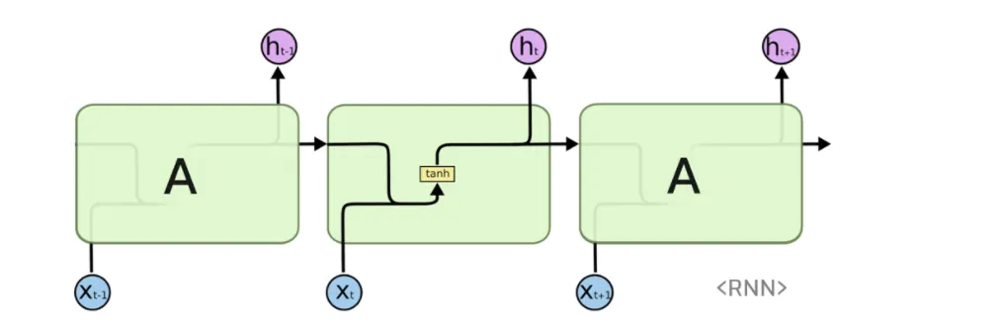

# 5주차 — RNN

### 🔑 키워드

- Sequence
- Hidden state
- Vanishing / Exploding gradient
- BPTT
- LSTM / GRU

### 📌 핵심 포인트

- 기존 모델들이 왜 과거 정보를 잃는가
- LSTM이 게이트로 뭘 해결했는가
- 순환 구조의 한계
- 병렬화 불가능 문제

# RNN

[https://casa-de-feel.tistory.com/39](https://casa-de-feel.tistory.com/39)

- Recurrent Neural Network, 순환 신경망
- 입력과 출력을 시퀀스 단위로 처리하는 모델

## 시퀀스(Sequence)

- 문장처럼 단어(데이터)가 순서대로 나열된 것
- 데이터가 독립적이지 않고, 앞뒤 문맥에 따라 의미가 달라지는 데이터
- RNN은 이러한 시퀀스 데이터를 처리하기 위해 만들어짐
    - 기존 신경망(FFN/CNN)과의 차이점
        - FFN: 입력이 한 방향으로만 흐르는 신경망(입력 → 은닉층 → 출력층)
        - CNN: 입력의 공간적 구조(위치, 패턴) 를 유지하며 특징을 추출하는 신경망
    
    | **비교 항목** | **기존 신경망 (FFN / CNN)** | **순환 신경망 (RNN)** |
    | --- | --- | --- |
    | **처리 방식** | **독립적 (Independent)** | **순차적 (Sequential)** |
    | **데이터 인식** | 각 입력을 개별 사건으로 봄 | 이전 입력과 현재 입력을 연결해서 봄 |
    | **기억(Memory)** | **없음 (Memory-less)** | **있음 (Hidden State)** |
    | **입력 길이** | 고정됨  | 가변적  |
    | **비유** | **사진** (멈춰있는 한 장면) | **동영상** (스토리가 이어짐) |
    
    **RNN**은 '기억(Memory)'을 통해 데이터의 전후 관계(Context)를 파악할 수 있다는 점이 가장 큰 차이다.
    
    - 순서가 있는 데이터의 특성
        - 순서 민감성: 데이터의 순서(위치)가 바뀌면 의미가 완전히 달라지거나 파괴됨
        - 문맥 의존성: 현재 시점의 데이터만으로는 정확한 의미를 알 수 없으며, 이전(과거) 데이터의 영향을 받음
        - 가변적인 길이: 데이터마다 길이가 고정되어 있지 않고 제각각임
        기존 신경망은 입력 크기가 고정이라 이를 처리하기 어렵지만 RNN은 순차적으로 처리하므로 길이 제약이 없다

## 구조 및 작동 원리

- 셀(Cell) =  초록색 네모 박스
    - 정의:  RNN의 은닉층에서 활성화 함수를 통해 결과를 내보내는 노드
    - 이 안에서 연산이 일어나고 기억해야 할 정보를 처리함
    - 이전의 값을 기억하려고 하기 때문에 메모리 셀(Memory Cell)이라고도 부름
- 은닉 상태(Hidden State) = 초록색 박스에서 나와서 다음 초록색 박스로 이어지는 화살표를 타고 전달되는 값
    - 은닉층의 메모리 셀에서 나온 값이 다시 다음 시점의 은닉층 메모리 셀로 입력됨 =  순환 구조
    - 이때 셀에서 출력되어 다음 셀로 전달되는 값을 은닉 상태라고 부름
    - 과거 정보를 기억하는 메커니즘
    - t 시점의 메모리 셀은 t-1 시점의 메모리 셀이 보낸 은닉 상태값을 t 시점의 은닉 상태 계산을 위한 입력값으로 사용함

### RNN 표현 방식 정리

xt (아래쪽 회색 박스): 현재 시점의 입력값 (예: 문장의 t번째 단어)
yt (위쪽 회색 박스): 현재 시점의 출력값 (예: 다음 단어 예측 결과)

초록색 박스(셀)가 이전 화살표(은닉 상태)와 아래쪽 박스(입력)를 받아서, 오른쪽(다음 은닉 상태)과 위쪽(출력)으로 내보내는 구조

- **사이클 형태 표현**
    - 하나의 노드에 자기 자신으로 돌아오는 화살표(순환 구조)를 그려 표현
    - “이전 시점의 정보가 현재 시점에 다시 입력된다”는 순환 구조를 강조
- **시간 축으로 펼친 표현**
    - 동일한 RNN 구조를 시점 t-1, t, t+1, ... 순으로 나열하여 표현
    - 실제로는 하나의 셀이 계속 도는 것이지만, 학습 과정을 이해하기 쉽게 **마치 여러 층(Layer)이 있는 신경망처럼** 시각화함
    - 시간에 따라 은닉 상태가 어떻게 전달되는지 직관적으로 보여줌

→ 두 표현의 차이는 그림을 그리는 방식뿐이며, 사이클 화살표로 표현했느냐, 시간의 흐름에 따라 펼쳐 표현했느냐의 차이일 뿐 모두 동일한 RNN 모델을 나타낸다.

이전의 메모리 셀 출력 값과 현재의 입력 값 두 개가 입력으로 사용됨
= RNN은 입력과 출력의 길이를 다르게 설계할 수 있어 다양한 용도로 사용할 수 있는 장점이 있음

### RNN의 3가지 활용 유형

1. 일 대 다 (One-to-Many)
    
    
    
- **구조**: 입력은 1개인데, 출력은 여러 개(시퀀스)인 형태
- 하나의 이미지 입력에 대해서 사진의 제목을 출력하는 **이미지 캡셔닝**에 사용 가능
- 사진의 제목이 단어들의 나열이므로 시퀀스 출력
1. 다 대 일 (Many-to-One)
    
    
    
- **구조**: 입력은 여러 개(시퀀스)인데, 출력은 딱 1인 형태
- 입력 문서가 긍정적인지 부정적인지 판단하는 **감성 분류** & 정상 메일인지 스팸 메일인지 분류하는 **스팸 메일 분류**에 사용 가능
1. 다 대 다 (Many-to-Many)
    
    
    
- **구조**: 입력도 여러개, 출력도 여러 개인 형태
- 챗봇, 번역기, 개체명 인식 등에 사용 가능
    - **챗봇**: [질문 문장] → [대답 문장]
    - **번역기**: [한국어 문장] → [영어 문장]

### RNN의 출력 방식

- return_sequences는
    
    → RNN이 출력을 어느 시점까지 내보낼지를 정하는 파라미터
    
- return_sequences = False (기본값)
    - **마지막 시점의 은닉 상태만 반환**
    - 문장 전체를 읽고 최종 요약 결과만 필요할 때 사용
    - 주로 다 대 일 (Many-to-One) 모델(감성 분류, 문장 분류 등)에 사용
- return_sequences = True
    - **모든 시점의 은닉 상태를 반환**
    - 각 시점의 정보가 모두 필요할 때 사용
    - 다 대 다(Many-to-Many) 모델이거나, RNN을 여러 층으로 쌓을 때 필수

→ 중간 과정이 필요 없으면 False, 시간별 출력이 필요하면 True

RNN에서 말하는 출력은

**은닉 상태 h 자체가 아니라, 은닉 상태가 활성화 함수를 지난 값
=** 은닉 상태는 내부 메모리 역할을 하며, 실제 출력은 가중치와 활성화 함수를 적용한 값으로 해석된다.

## RNN의 학습 방법

### BPTT (Backpropagation Through Time)

- **정의**
    - 시간을 거슬러 올라가는 역전파
    - RNN을 시간 축으로 펼친(unrolling) 후, 현재의 에러를 줄이기 위해 과거 시점까지 거슬러 올라가며 가중치를 업데이트하는 역전파 알고리즘
- **동작 원리**
    - RNN의 각 타임 스텝은 동일한 구조의 신경망으로 볼 수 있음
    타임 스텝: RNN이 한 번 계산을 수행하는 단위
    - 역전파 시, 화살표가 **하나의 박스를 지날 때마다 미분값(기울기)을 곱함**
    - 타임 스텝이 많아질수록 곱해지는 미분값의 횟수도 증가함
- BPTT는 **타임 스텝을 따라 거슬러 올라가며 기울기를 계산하는 학습 방법**

- xt: 입력값(Input)
- st: 은닉 상태(Hidden State) = 이전 시점(s_t-1)의 기억과 현재 입력(xt)을 합쳐서 만들음
- ot: 출력값(Output)
- 3가지 가중치 U, W, V
    - U (Input → Hidden 가중치) = 지금 들어온 새로운 정보(xt)를 얼마나 중요하게 반영할까?를 결정 = 입력 처리용
    - W (Hidden → Hidden 가중치) = 과거의 기억(s_{t-1})을 현재로 가져올 때, 얼마나 잊고 얼마나 가져올까?를 결정 = 기억 전달용
    - V (Hidden → Output 가중치) = 현재 계산된 은닉 상태(st)를 바탕으로, 최종적으로 어떤 정답(ot)을 내보낼까?를 결정 = 결과 출력용

그림을 보면 모든 시점(t-1, t, t+1)에서 똑같이 U,W,V를 사용하는 것을 볼 수 있음
이는 **모든 시점에서 동일한 가중치를 돌려 쓴다**는 것을 의미함

- E는 각 시점의 Error
- x0, x1, …은 각 시점의 입력값이고 s0, s1, …은 각 시점의 은닉 상태
- RNN에서는 이전 모든 시점의 Error를 활용해서 학습을 함
    
    RNN은 모든 타임 스텝에서 동일한 가중치를 공유하므로, BPTT에서는 각 시점에서 발생한 에러를 모두 고려하여 기울기를 합산한 뒤 가중치를 업데이트한다
    
    최종 값은 모든 시점의 오차를 다 더한 값 → $Loss_{total} = E_0 + E_1 + E_2 + E_3 + E_4$
    
- RNN은 학습 과정에서 에러를 과거 시점으로 계속 전파하는데, 이 전파 경로가 길어질수록 기울기 값이 점점 작아져 0에 가까워지는 **기울기 소실(Vanishing Gradient)** 문제가 발생한다

## 기존 RNN의 문제점

### 장기 의존성

- 기존 모델들은 먼 과거의 정보를 잃어버림
    - 입력 시점과 출력 시점 사이의 **거리가 멀어질수록** 과거 정보가 현재 판단에 제대로 반영되지 않는 현상
    - 문맥 전체를 보지 못하고, **가장 최근에 들어온 정보**에만 의존하여 판단하게 됨
    - BPTT 과정에서 기울기가 소실(Vanishing)되어, 과거 시점까지 업데이트 신호가 도달하지 못하기 때문

### 기울기 소실**(Vanishing Gradient)**

- 박스가 100개라면, 기울기를 **100번 연속으로 곱해야** 가장 처음 시점까지 전달됨
- 이때 미분값이 1보다 작으면 값이 점점 작아짐
- 결국 과거 시점으로 갈수록 **기울기가 거의 전달되지 않게 되는데**,
    
    이를 **Vanishing Gradient(기울기 소실)** 문제라고 한다.
    → 기존 모델들이 과거 정보를 잃게 되는 이유
    
    
    

특히

- **tanh**, **sigmoid** 활성화 함수의 미분값이
    
    대부분 0< 미분값 <1 이기 때문에 이 값들이 반복적으로 곱해지며 문제가 심화됨
    **Sigmoid 미분 최댓값**: 0.25(가장 가파른 곳도 기울기가 0.25밖에 안 됨)
    **Tanh 미분 최댓값**: 1.0 (x=0일 때만 1이고, 나머지는 1보다 작음)
    

## 해결책

[https://huidea.tistory.com/237](https://huidea.tistory.com/237)

### LSTM (Long Short-Term Memory)

기본 RNN은 구조가 단순해서 금방 까먹는다

- 가운데 초록색 박스 안을 보면 Layer가 딱 1개(tanh)밖에 없음
- 이전 정보와 현재 정보를 합쳐서 tanh 함수로 어떤 큰 숫자가 들어와도, -1과 1 사이의 얌전한 숫자로 바꿔서 내보낸다
- 별도의 제어 장치가 없어서, 새로운 정보가 들어오면 과거의 정보가 쉽게 희석되거나 사라짐

- 기존 RNN 셀에 4개의 상호작용 레이어를 추가하여 정보의 흐름을 정교하게 제어함
- 가운데 초록색 박스 안을 보면 Layer가 4개나 있음(시그모이드 함수 3개 tanh 1개)
    - 시그모이드 Layer들이 게이트다
        - 첫 번째: 망각 게이트(불필요한 정보 지우기)
        - 두 번째(시그모이드 함수 + tanh): 입력 게이트(새로운 중요 정보 저장하기)
        - 세 번째: 출력 게이트(다음 시점으로 보낼 정보 정제하기)
- 이들이 서로 상호작용하며 정보를 얼마나 기억할지 정교하게 계산함

- **핵심 아이디어:** 셀 상태(Cell State) = 고속도로처럼 정보가 흐르는 경로 = 곱하기와 더하기 연산만 거치며 정보가 큰 변형 없이 전체를 쭉 흘러가게 만들어줌 = 기울기 소실 없이 먼 과거의 정보를 유지함
    - 그림에서의 맨 위를 관통하는 검은
- **특징**: 2개의 벡터 ( 단기 상태 ht / 장기 상태 Ct ), 3개의 게이트 ( input gate, output gate 그리고 forget gate )
- **게이트(Gate) 메커니즘:**
    - Forget Gate (망각 게이트): 불필요한 과거 정보 삭제
    - Input Gate (입력 게이트): 현재 정보를 얼마나 저장할지 결정
    - Output Gate (출력 게이트): 다음 은닉 상태로 무엇을 내보낼지 결정

### GRU (Gated Recurrent Unit)

- 왼쪽 시그모이드 함수: 리셋 게이트(Reset Gate) 
과거의 기억 h_(t-1) 중 **필요 없는 건 지우고(Reset)**, 남은 것만 tanh로 보내서 새로운 정보를 만든다
- 그림 중앙에 ‘1-’라고 적힌 타원형 버블: GRU의 핵심인 업데이트 게이트의 특징
- 오른쪽 시그모이드 함수 + ‘1-’ 타원형 버블: 업데이트 게이트(Update Gate)
한쪽은 그대로 가고 다른 한쪽은 1-(전체에서 뺌) 연산을 한다
과거의 정보 h_(t-1)와 새로운 정보 ht(tanh 결과)를 어떤 비율로 섞을까? 계산
- tanh 박스: 리셋 게이트를 통과한 정제된 과거와 현재 입력을 합쳐서 새로운 후보 기억을 만드는 곳

- LSTM의 간소화 버전 (Reset Gate, Update Gate) = 3개의 게이트를 2개로 축소
    - LSTM은 성능이 좋지만 구조가 너무 복잡하고 연산량이 많음
    - **LSTM**: **3개** (망각, 입력, 출력) / **GRU**: **2개** (리셋 r, 업데이트 z)
    - 업데이트 게이트(z): LSTM의 [입력 게이트] + [망각 게이트]
    과거의 정보를 얼마나 유지하고(1-z), 새로운 정보를 얼마나 추가할지(z)"를 하나의 게이트로 동시에 결정
    - 리셋 게이트(r): 이전 은닉 상태 h(t-1)가 현재의 정보를 계산할 때 얼마나 반영될지를 결정
- **상태 통합**: **Cell State와 Hidden State를 합쳐서** 하나의 은닉 상태(ht)로 관리
    - **LSTM**: 셀 상태(ct, 내부 기억)와 은닉 상태(ht, 출력)가 분리되어 있음
    - **GRU**: 셀 상태가 사라지고 **은닉 상태(ht) 하나로 통합**됨. (즉, 내부 메모리 값 = 외부 출력 값)
- LSTM과의 차이점 및 장단점 비교

| **비교 항목** | **LSTM** | **GRU** |
| --- | --- | --- |
| **게이트 수** | 3개 (Forget, Input, Output) | 2개 (Reset, Update) |
| **파라미터 수** | 많음 (복잡함) | 적음 (단순함) |
| **학습 속도** | 상대적으로 느림 | **상대적으로 빠름** |
| **데이터 양** | 데이터가 **많을 때** 유리 | 데이터가 **적을 때** 유리 |
| **성능** | 강력하지만 무거움 | 가볍지만 성능은 LSTM과 비등함 |

## 순환 구조의 구조적 한계

### 병렬화 불가능 문제

- **원인**: t 시점의 은닉 상태 h_t를 구하려면, 반드시 직전 시점의 h_{t-1}이 계산되어야 한다
    
    
    
- 입력 데이터가 100개라면 1번부터 100번까지 무조건 순서대로 계산해야 함

### GPU 효율성 저하

- GPU는 수천 개의 코어로 동시에 많이 계산할 때 엄청난 성능을 발휘함
- RNN은 계산이 순차적으로 이루어지므로 GPU의 수천 개의 코어가 아무것도 안 하고 놀고 있음
- 고성능 GPU를 써도 학습 속도가 엄청 빨라지지 않아서 비효율적임

 

### Transformer

- RNN의 한계(느린 속도 + 장기 의존성 문제)를 극복하기 위한 방법
- 순서대로 보지 말고, 문장 전체를 **한 번에** 입력해서 단어들 간의 관계를 계산하자
    - h_(t-1)을 기다릴 필요가 없어짐 → **병렬 처리 가능**
    - GPU 효율 극대화 → **학습 속도 비약적 상승**
    - 이것이 바로 **Transformer**이며, 오늘날 **GPT**의 시초가 됨.