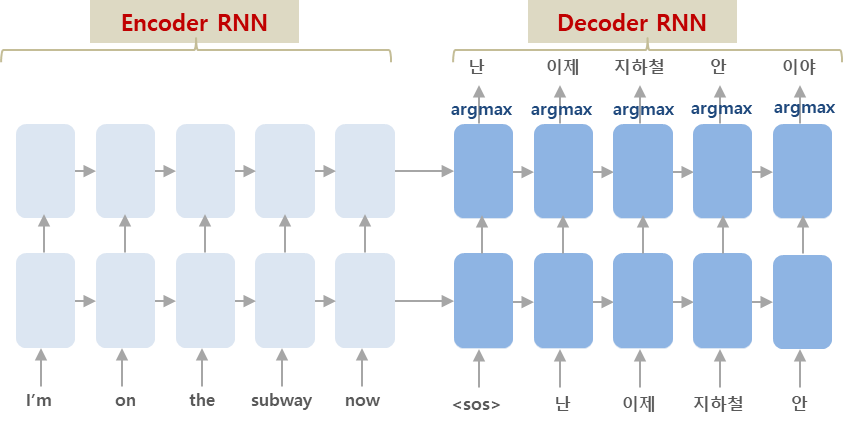
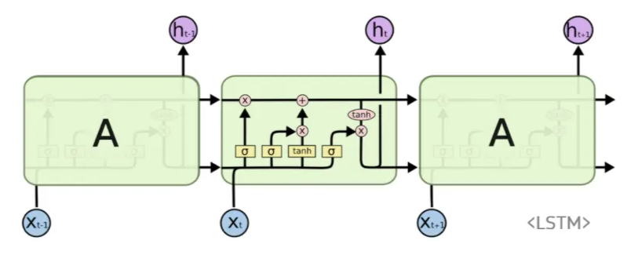
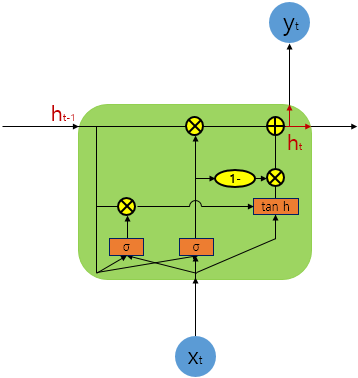
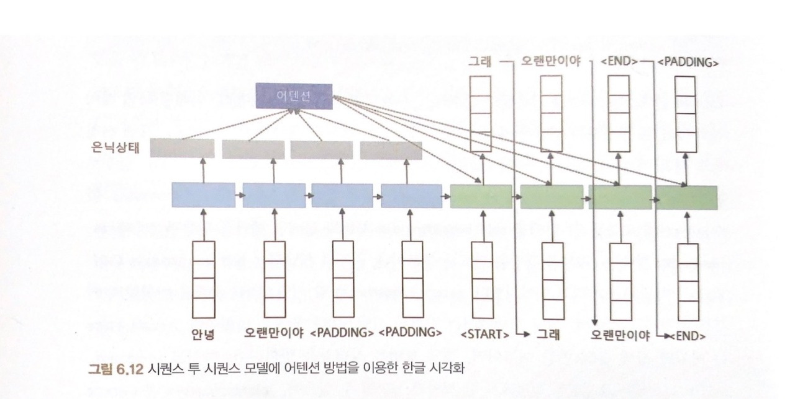
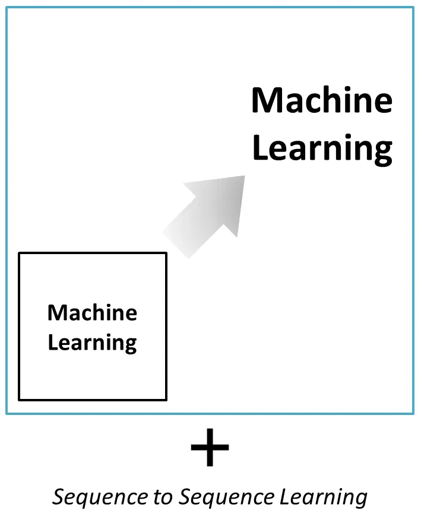
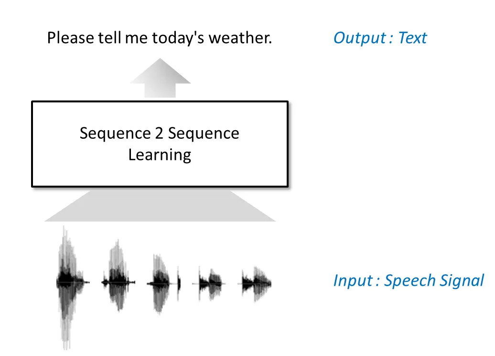
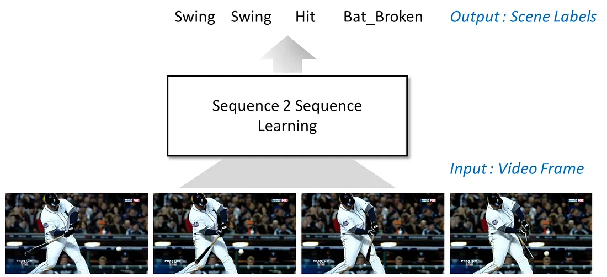

# 6주차 — Seq2Seq

### 🔑 키워드

- Encoder–Decoder
- Context vector
- Teacher forcing
- Attention (초기 형태)

### 📌 핵심 포인트

- Seq2Seq가 번역을 가능하게 만든 이유
- 고정 길이 Context vector의 한계
- Attention이 “정보 병목”을 어떻게 푸는가

# Seq2Seq

[https://velog.io/@lighthouse97/seq2seq-모델에-대한-이해](https://velog.io/@lighthouse97/seq2seq-%EB%AA%A8%EB%8D%B8%EC%97%90-%EB%8C%80%ED%95%9C-%EC%9D%B4%ED%95%B4)

- 한 문장(시퀀스)을 다른 문장(시퀀스)으로 변환하는 모델
- 시퀀스 입력을 받아 시퀀스 출력을 만드는 번역 모델의 시초

2개의 RNN을 인코더-디코더 구조로 사용함
→ 원본 문장을 인코딩할 때 사용되는 파라미터와 디코딩에 사용되는 파라미터가 다르기 때문
→ 하나의 모델이 두개를 동시에 하려 할 때보다 훨씬 효율적, 입출력 길이의 제약을 없앰

기존 방식: 
입력이 들어올 때마다 바로 출력을 내보내려 하면, 어순이 다른 언어(예를 들면 영어 ↔ 한국어)를 처리하기 어렵고 길이 차이를 맞추기 힘듬

Seq2Seq: 
인코더가 다 읽을 때까지 디코더는 기다리고, 인코더가 끝나면(Context Vector 완성) 그때부터 디코더가 작동함 → 길이 불일치 문제를 해결

문장을 끝까지 다 읽고(Context Vector 생성) 번역을 시작하므로, 어순이 달라도 문맥을 파악해서 번역 가능함 → 어순 불일치 문제를 해결

인코더와 디코더는 RNN으로 구성되어 있음(LSTM이나 GRU가 사용되는데 위의 예시에서는 LSTM을 사용)

LSTM: 입력, 망각, 출력 게이트를 통해 중요 정보를 오래 기억함

GRU: LSTM을 간소화하여 연산 효율을 높인 구조

- 영어 문장을 입력(input)으로 seq2seq 모델에 넣으면 불어 문장을 출력(output)
- **인코더**가 문장을 읽어 **Context Vector**라는 '쪽지'에 핵심만 적어서 디코더에게 넘겨주면, **디코더**가 그 쪽지를 보고 번역문을 만드는 구조

### 내부 구조

- 인코더(Encoder)
    - 입력 데이터를 의미 있는 내부 표현으로 변환함
    - 입력 간의 관계와 문맥을 학습하여 요약함
    - 입력된 문장(Sequence)을 단어 단위로 순서대로 읽어 들여, 그 의미와 정보를 벡터(숫자) 형태로 변환
    - 문장의 모든 정보를 압축하여 Context Vector 생성
    
    **은닉 상태(Hidden State)의 흐름: 정보는 두 방향으로 흐른다**
    
    - 오른쪽 (시간 방향): 다음 시점의 LSTM 셀로 정보 전달, 앞 내용을 기억해야 뒷 내용을 이해할 수 있음 (필수)
    - 위쪽 (깊이 방향): 더 깊은 층이 있다면 위로 전달하지만, 단일 레이어 모델인 경우 이 출력은 폐기됨

간단한 seq2seq 모델에서 Context Vector는 인코더의 마지막 스텝이 출력한 은닉(hidden) 상태와 같음(RNN 모델에서의 hidden state, 마지막 시점의 은닉 상태에는 첫 단어부터 끝 단어까지의 정보가 누적되어 압축되어 있음)

- CONTEXT Vector
    - 인코더와 디코더를 잇는 정보 전달의 다리
    - 인코더가 입력 문장을 다 읽고 난 후 만들어낸 최종 결과물
    - 입력 문장의 모든 정보(문맥, 의미 등)가 이 안에 요약되어 있으며, 이 벡터 하나만 디코더로 전달됨
    - **주의 :** 고정된 크기(Fixed-size)이기 때문에 문장이 길어지면 모든 정보를 담기 힘들어 정보 손실(Information Bottleneck)이 발생함
    
    이때 발생하는 정보 손실을 해결하기 위해 Attention 기법을 사용함
    
    ## Attention
    
    
    
- 디코더에서 출력 단어를 예측하는 매 스텝마다, 인코더에서의 전체 입력 문장을 다시 한 번 참고함

- **기존 Seq2Seq:** 마지막 은닉 상태(Last Hidden State) 하나에 모든 정보를 압축해서 넘겨줌 → 압축 과정에서 정보 손실(병목) 발생
- **어텐션:** 압축된 것만 믿지 않고, 인코더의 모든 은닉 상태(모든 회색 박스)를 디코더가 직접 볼 수 있게 열어줌 → 모든 정보를 다 참고할 수 있으니 병목이 사라짐

- 사진에서 보면 기존 Seq2Seq는 맨 마지막 회색 박스 하나만 넘겨줬다면, 어텐션 모델은 저 모든 회색 박스들을 다 활용함
    - <PADDING>: 문장 길이를 맞추기 위해 넣은 의미 없는 토큰
    실제 계산에서는 <PADDING> 위치에 **mask를 씌워 attention 점수가 0이 되도록 함**
- 주어진 '쿼리'에 대해서 모든 '키'와의 유사도를 각각 구하고 각각의 값에 반영해줌
- 유사도가 반영된 ‘값’을 모두 해서 리턴하면 이를 **어텐션 값(Attention Value)**이라고 함
    - **Query(Q)** : 지금 내가 찾고 싶은 정보 (디코더의 현재 상태)
    - **Key(K)** : 각 단어가 어떤 정보인지에 대한 주소
    - **Value(V)** : 실제로 가져올 정보
    
    Q와 K의 유사도로 V를 얼마나 볼지 결정한다
    

<aside>
💡

Attention(Q, K, V) = Attention Value

</aside>

- 디코더(Decoder)
    - 인코더가 만든 Context Vector를 입력으로 받아 이를 바탕으로 출력 데이터를 순차적으로 생성하는 모델
    - 전달받은 Context Vector를 풀어서 타겟 언어로 한 단어씩 만들어 냄

- 특수 토큰
    - <sos> (Start Of String): 문장의 시작을 알림.
    - <eos> (End Of String): 문장의 끝을 알림 (생성 종료).

### 디코더 작동 순서

1. **초기화:** 인코더로부터 받은 **Context Vector**와 시작 토큰 <sos>가 입력됨.
2. **첫 예측:** 가장 등장할 확률이 높은 단어(예: je)를 예측.
3. **재귀적 입력:** 방금 예측한 단어(je)를 **다음 스텝의 입력**으로 사용.
4. **반복:** 다음 단어(예: suis)를 예측하며, <eos>가 나올 때까지 이 과정을 반복.

이런 식으로 문장 내 모든 단어에 대해 반복

하지만 이는 모델의 학습 후 Test 단계에서의 디코더 작동 원리

**테스트(Test) 단계**에서는 모델이 예측한 단어를 다시 입력으로 사용

- 정확한 예측이 선행된 경우
    - **Affine (파란색):** 선형 변환 층(Fully Connected Layer),  LSTM이 내뱉은 은닉 상태 벡터(Hidden State)를 우리가 사용하는 **전체 단어장(Vocabulary) 크기의 벡터**로 변환함
    - **Softmax (빨간색):** 확률 변환 층, Affine 층에서 나온 숫자들을 **0~1 사이의 확률값**으로 바. 여기서 확률이 가장 높은 단어가 최종 출력 단어로 선택됩니다.

- 잘못된 예측이 선행된 경우
    
    **문제점:** “그동안”이 나왔어야 했는데 모델이 실수로 “저녁은”을 예측해버림, 디코더는 이것을 믿고 다음 말을 이어가게 됨. 결국 원래 의도와 상관없이 전혀 다른 문장을 생성하게 됨 (스노우볼 효과)
    
    모델이 이전 시점의 자신의 예측값을 디코더 입력으로 사용하며, 반복적으로 다음 시점을 예측함
    
    - 초기 학습 단계에서 잘못된 예측이 누적되면 문장 품질이 저하됨
    - 학습 속도가 느려질 수 있음

**학습(Train) 단계**에서는 정답 단어를 다음 입력으로 넣어줌 (**Teacher Forcing**)

## Teacher Forcing

이전 시점의 예측값 대신 실제 정답(ground truth)을 디코더 입력으로 사용하는 방법

모델이 “그동안” 대신 “저녁은”(오답)을 예측하더라도 실제 정답(ground truth)이 개입해서 다음 입력에서 모델의 예측값(저녁은)을 버리고, 실제 정답 데이터(그동안)를 강제로 넣게 함. 결국 다음 단계에서는 정상적인 문맥이 나옴

목적

- 학습을 더 빠르게 수렴시킴 → 학습 속도 증가
- 초기 학습 과정에서 모델이 틀린 예측을 연속적으로 반복하는 문제를 방지

## 적용 범위

[https://medium.com/@hugmanskj/sequence-to-sequence-learning-소개-7107a1d8d705](https://medium.com/@hugmanskj/sequence-to-sequence-learning-%EC%86%8C%EA%B0%9C-7107a1d8d705)

- 기존 머신 러닝에 Sequence to Sequence Learning 을 더해서 머신러닝이 해결할 수 있는 문제의 범위가 훨씬 커졌음
- 특정 문제를 일련의 시퀀스로 바라보고 이를 다른 시퀀스로 변환하는 방식
- 단순히 인식하는 것을 넘어, 언어를 이해하고 생성하는 것까지 가능
- **기계 번역, 챗봇, 문장 요약** 등 창조적인 시퀀스 생성

### 음성 인식

**기존 방식 (복잡함)**

- 두 가지 모델을 따로 만들어 합쳐야.
    - **음향 모델링:** 소리(음향)를 듣고 단어를 맞춤
    - **언어 모델링:** 문맥을 보고 다음 단어를 예측함

**Seq2Seq 방식** 

- **End-to-End (종단간) 학습:** 복잡한 단계 없이 [음성 데이터]를 넣으면 바로 [텍스트]가 나오도록 한 번에 처리함
- 구조가 훨씬 단순해지고 직관적으로 변함

- 가장 성능이 좋고 유명한 Seq2Seq 기반 모델인 **OpenAI의 Whisper(위스퍼)** 모델을 사용
- 복잡한 음향 모델이나 언어 모델을 따로 구축할 필요 없이,  [오디오 파일] → [모델] → [텍스트]가 단 몇 줄의 코드로 끝
- **pipeline(..., model="openai/whisper-tiny")**:
    - 인코더(Encoder)와 디코더(Decoder)가 합쳐진 Seq2Seq 모델 전체를 불러오는 과정
    - 과거처럼 "음향 모델" 따로, "발음 사전" 따로, "언어 모델" 따로 불러올 필요가 없다
- **transcriber(audio_input):**
    - 위에서 만든 'transcriber' 기계에 실제 데이터(오디오)를 집어넣음
    - 여기가 **End-to-End**가 일어나는 지점
    - 입력으로 오디오를 던져주니, 중간 과정0을 신경 쓸 필요 없이 바로 **텍스트**가 튀어나옴

### 영상 처리

**기존 방식 (복잡함)**

- 특정 이벤트(예: 배트가 부러짐)를 찾기 위해 사람의 움직임을 추적하거나 궤적을 분석하는 등 고난이도의 영상 처리 기술과 지식이 필요

**Seq2Seq 방식 (단순화)**

- **프레임 시퀀스 처리:** 영상을 복잡하게 분석하는 대신, 1초당 60장과 같이 쪼개진 이미지들의 순서(Sequence)로 취급
- **입출력 구조:**
    - **입력:** 프레임 이미지 시퀀스
    - **출력:** 각 프레임에 해당하는 이벤트 라벨 시퀀스 (예: [스윙], [스윙], [배트 부러짐], [달리기])
- 마치 번역기처럼 [영상 프레임]을 입력받아 [상황 설명 라벨]로 번역해 주는 방식

**의의 (접근성 확대)**

- **전문 지식 불필요:** 복잡한 알고리즘을 짤 필요 없이 [영상 데이터]와 [정답 라벨]만 있으면 누구나 모델을 만들 수 있음
- **범용성:** 배트가 부러지는 것뿐만 아니라, 데이터만 바꾸면 다양한 종류의 이벤트를 검출하는 모델로 쉽게 응용할 수 있음

- 가장 유명한 영상 행동 인식 모델인 **VideoMAE**를 사용
- 영상을 보고 "이 사람이 무엇을 하고 있는지(예: 야구 스윙, 달리기, 음식 먹기)"를 맞추는 코드
- **[영상 프레임 입력] → [상황 라벨 출력]**
- **pipeline("video-classification", ...)**:
    - Encoder(영상 프레임 분석)와 Decoder(라벨 분류)를 모두 포함한 모델을 불러옴
    - 모델 내부적으로 영상을 초당 16장~60장의 이미지 시퀀스로 쪼갭니다. (프레임 시퀀스 처리가 자동 수행됨)
- **video_classifier(file_path)**:
    - 영상을 집어넣으면 모델이 프레임들의 움직임(Sequence)을 읽
    - **Encoder:**  첫 프레임엔 포크를 들었고, 다음 프레임엔 입으로 가져가네? (움직임 포착)
    - **Decoder:** 이 움직임의 패턴(Context Vector)을 보니 라벨은 eating spaghetti야 (번역)