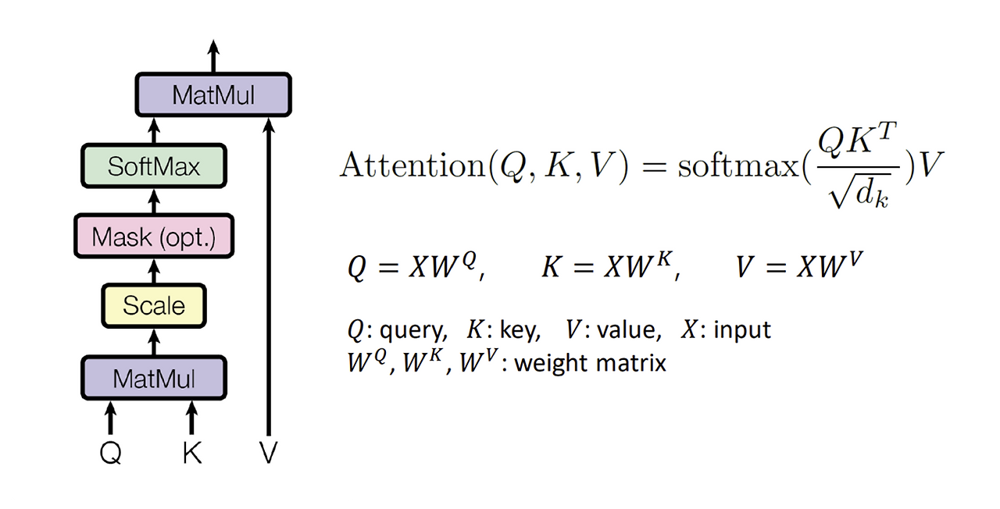
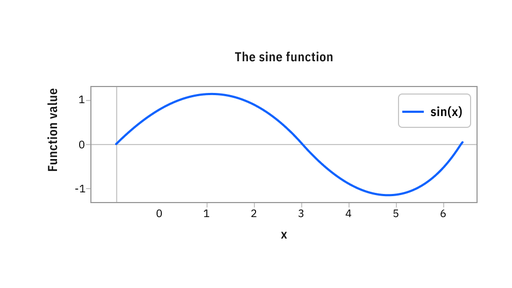

# 7주차 — Transformer

### 🔑 키워드

- Self-Attention
- Q / K / V
- Multi-head attention
- Positional Encoding
- Parallelism

### 📌 핵심 포인트

- Attention이 RNN을 대체한 이유
- 왜 O(n²) 비용을 감수하는가
- Position 정보를 어떻게 주입하는가
- Encoder vs Decoder 구조 차이

### RNN을 대체한 Transformer:

순서대로(Sequential) 읽지 말고, 한 번에(Parallel) 다 보자!

- **기존(RNN/LSTM):** 단어를 하나씩 순서대로 처리함.
    - 문제 1: **속도 느림** 앞 단어 계산 끝날 때까지 뒷 단어 계산 못 함, 병렬화 불가
    - 문제 2: **장기 의존성** 문장이 길어지면 앞 내용을 까먹음
- Transformer: 문장 전체를 한 번에 행렬로 입력받음.
    - 해결 1: **병렬 처리(Parallelism) 가능** 학습 속도 비약적 향상
    - 해결 2: **Self-Attention**으로 거리에 상관없이 모든 단어 간의 관계를 거리 제한 없이 즉시 직접 계산

Transformer의 **역할**

- Attention 메커니즘을 사용하여 입력 시퀀스의 모든 요소 간의 관계를 동시에 고려함
    - **기존 (RNN):** "나는" →"밥을" → "먹는다" 순서로, 앞 단어를 잊어버리면 뒷 단어를 해석 못 함
    - **Transformer:** 문장 전체("나는 밥을 먹는다")를 하나의 그림처럼 **동시에 펼쳐 놓고** 본다
- 인코더와 디코더 구조로 이루어짐
    - 기계 번역(Seq2Seq)을 위해 탄생했기에 두 파트로 나
- 각 요소 간의 종속성을 병렬로 처리 가능
    - **기존 (RNN):** 순차적(Sequential) 데이터 처리가 필수라 GPU의 병렬 연산 능력을 100% 활용하지 못함 (앞 단계 계산이 끝나야 다음 단계로 넘어감)
    - **Transformer:** 순서 정보는 **Positional Encoding**으로 대체하고, 실제 연산은 행렬 곱(Matrix Multiplication)으로 한 방에 처리

문장의 길이가 n일 때, 모든 단어 쌍(n*n)의 관계를 계산해야 하므로 연산량이 O(n^2)로 늘어난다. (RNN은 O(n))문장이 길어질수록 메모리와 계산 비용이 제곱으로 든다

→ 그치만 병렬 처리가 가능해 학습 시간이 줄어들고, 직접 연결을 통해 정보 손실이 없는 장점이 있으니 이를 감수하고 Transformer를 쓴다

## **Self-Attention**

문장 내의 단어들이 서로 어떤 관계(관련성)가 있는지 계산하는 과정

### **Q, K, V (Query, Key, Value)**

검색 엔진에 비유

- **Query (Q):** 내가 던지는 질문 (현재 분석하려는 단어). 입력 문장의 모든 단어에 대한 벡터
*"나(Q)랑 관련된 애 누구야?"*
- **Key (K):** 검색 대상이 되는 데이터의 라벨 (다른 모든 단어들). 입력 문장의 모든 단어에 대한 벡터
*"저(K) 여기 있어요."*
- **Value (V):** 실제 데이터의 내용 (의미 정보). 입력 문장의 모든 단어에 대한 벡터
*"여기 제 정보(V) 가져가세요."*

연산 과정

1. **Q * K^T (내적):** 두 벡터가 얼마나 유사한지(관련 있는지) 계산. 값이 클수록 관련성이 높음
2. **Scale:** 차원(d_k)이 커지면 내적 값이 너무 커져서 Softmax 기울기가 소실되는 것을 방지
3. **Softmax:** 관련성 점수를 확률(0~1)로 변환 (합은 1)
4. *** V:** 확률 가중치를 적용하여 Value 값들을 섞음. (관련 있는 단어의 정보를 많이 가져옴)

## Multi-Head Attention

여러 명의 전문가가 다양한 관점에서 분석한다

왜 머리가 하나인 것보다 여러 개인 것이 더 좋을까?
→ 기본적인 Self-Attention은 문장 내의 단어 사이의 연관성(확률)을 계산하는데 **하나의 Attention Head**만 사용하면 다음과 같은 문제가 생김

**문제점:** **단어의 관계는 중의적이다**

- 예문: *"나는 배가 고파서 배를 먹었다."*
- 여기서 뒤쪽의 ‘배’는 두 가지 관계를 가짐
    1. **의미적 관계:** '먹었다'와 연결됨 (과일)
    2. **문법적 관계:** '배가(앞쪽)'와 연결됨 (동음이의어 구분)
- **Single-Head의 한계:** 만약 Head가 하나라면, 이 두 가지 정보를 섞어서(Average) 처리해야 하므로, **정보가 뭉개지거나 특정 정보만 선택**하게

**작동 원리**:

1. **Linear Projection (관점 나누기):**
원본 Query, Key, Value 벡터를 그대로 쓰지 않고, 서로 다른 가중치 행렬을 곱해 **차원을 축소**시킴
2.  **Attention (개별 분석):**
쪼개진 벡터들끼리 각각 독립적으로 Attention을 수행합니다. (h개의 Head가 병렬로 돌아감)
3. **Concatenation (정보 취합):**
•각 Head가 내놓은 결과 벡터들을 **일렬로 이어 붙임**
4. **Final Linear Layer (최종 결론):**
이어 붙인 벡터에 또 다른 가중치 행렬을 곱해, 원래의 차원 크기로 되돌리며 정보를 섞음

예시: 
**문장:** "The animal didn't cross the street because **it** was too tired."
여기서 "it"이 무엇을 가리키는지 파악할 때 Multi-Head가 어떻게 작동할까?
• **Head 1 (의미 파악 전문가):**
    ◦ **it**과 **animal** 사이의 연관성에 높은 점수를 줍니다.
   → *"it은 동물이구나."* (지시 대명사 해결)
• **Head 2 (상태 파악 전문가):**
    ◦ **it**과 **tired** 사이의 연관성에 높은 점수를 줍니다.
    → ”*it의 상태는 피곤하구나."* (형용사 연결)
• **Head 3 (행동 파악 전문가):**
    ◦ **it**과 **cross** 사이의 연관성에 주목합니다.
    →*"it이 길을 건너지 않았구나."* (주어-동사 연결)

**결과:** 최종적으로 모델은 "it"이라는 단어를 [동물 + 피곤함 + 건너지 않음]이라는 풍부한 맥락을 가진 벡터로 이해하게 됨

## Positional Encoding (위치 인코딩)

- 순서가 없는 집합(Set)에 순서(Sequence)를 부여함
- Transformer는 문장을 한 번에 처리(병렬화)하기 때문에 '순서 정보'가 사라지는 문제가 발생하며, 이를 해결하기 위해 단어 벡터에 위치 정보를 더해주는 'Positional Encoding'을 사용함

**어떻게 작동하는가? (Sinusoidal Functions)**
• **아이디어:** 각 단어의 임베딩 벡터에 **위치마다 고유한 패턴을 가진 벡터**를 더해줌
• **주기 함수 사용:** 사인(Sine)과 코사인(Cosine) 함수를 사용

$PE_{(pos, 2i)} = \sin(pos / 10000^{2i/d_{model}})$

$PE_{(pos, 2i+1)} = \cos(pos / 10000^{2i/d_{model}})$

[cosine-function_1x1.avif](cosine-function_1x1.avif)

    ◦ **짝수 인덱스:** 사인 함수(sin) 값을 사용
    ◦ **홀수 인덱스:** 코사인 함수(cos) 값을 사용

• **왜 하필 사인/코사인인가?**
    1. **고유성:** 모든 위치(pos)마다 서로 다른 고유한 벡터 값을 가짐
    2. **상대적 위치 파악:** 모델이 "단어 A가 단어 B보다 $k$만큼 뒤에 있구나"라는 **상대적 거리**를 학습하기 쉬움
    3. **길이 유연성:** 학습 때 보지 못한 더 긴 문장이 들어와도, 주기 함수의 패턴은 유지되므로 처리가 가능함

**Add vs Concat**
• Transformer는 위치 벡터를 단어 벡터에 **더한다(Add)**
• **이유:** 연결(Concat)하면 차원이 늘어나서 연산량이 증가한다. 더하더라도 고차원 공간에서는 단어의 의미 정보와 위치 정보가 충분히 구분되기 때문에 효율성을 위해 더하는 방식을 택

## Parallelism (병렬화)

Transformer가 기존의 RNN/LSTM을 제치고 **오늘날의 LLM(거대 언어 모델) 시대를 열 수 있게 만든 가장 결정적인 기술적 특징**

**RNN (기존 방식): 이어달리기 (Sequential)**
• 앞 단어(t-1)의 계산이 끝나야 바통을 넘겨받아 뒷 단어(t)를 계산할 수 있다
• 문장이 길어질수록 계산 시간이 정직하게 늘어난다 (O(n))
• **치명적 단점:** 최신 GPU는 수천 개의 코어를 가지고 있는데, 앞 단어 계산을 기다리느라 대부분의 코어가 **놀고 있다(Idle)**

**Transformer (혁신): 단체 합창 (Parallel)**
• 문장 전체("I love you")를 하나의 거대한 행렬(Matrix)로 묶어서 GPU에 던져준다
• 모든 단어 간의 관계(Attention)를 **행렬 곱셈 한 번**으로 동시에 계산한다
• 순서에 상관없이 모든 단어를 동시에 처리하므로, 문장이 아무리 길어도 이론상 한 번의 연산 단계(O(1))만 거치면 됨

장점:

- 단순 반복 계산을 동시에 엄청 많이 하는데 특화된 GPU 성능 100% 활용 → 학습 속도 빨라짐
- 대규모 학습 가능

## 이해하는 놈(Encoder) vs 말하는 놈(Decoder)

| **구분** | **Encoder (인코더)** | **Decoder (디코더)** |
| --- | --- | --- |
| **역할** | 입력 문맥을 **이해**하고 압축함. (Context 추출) | 인코더 정보를 바탕으로 문장을 **생성**함. |
| **시야(Visibility)** | **Bidirectional (양방향)**
문장의 앞뒤를 다 볼 수 있음 ("I love you" 전체 참조) | **Unidirectional (단방향)**
현재 단어 **이전**까지만 볼 수 있음. |
| **핵심 기술** | **Self-Attention** | **Masked Self-Attention** (치팅 방지) |
| **대표 모델** | **BERT** (이해, 분류, 빈칸 맞추기) | **GPT** (작문, 번역, 대화) |

Decoder의 **Masked Self-Attention:**
• 디코더는 정답을 생성하는 과정(학습)에서, 아직 예측하지 않은 미래의 단어(뒤에 올 단어)를 미리 보면 안 됨 (답지를 미리 보는 'Cheating' 방지)
• 그래서 자기 자신보다 뒤에 있는 단어들의 Attention Score를 **마스킹**하여 Softmax 값이 0이 되게 만든다
• 즉, "I love"를 입력받았을 때 "you"를 보지 못하게 가려놓고 예측하게 만든다