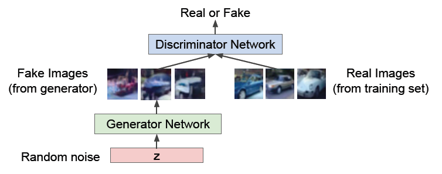
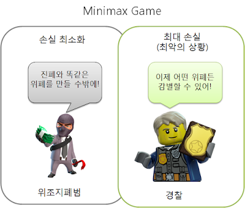
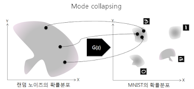

# 8주차 — GAN /  Diffusion Model

### 🔑 키워드

- Generator / Discriminator
- Minimax game
- Mode collapse
- Nash equilibrium

### 📌 핵심 포인트

- GAN이 “확률”을 직접 안 배우는 이유
- 왜 학습이 불안정한가
- 판별기가 너무 강하면 생기는 문제
- Diffusion과의 철학적 차이

### 🔑 키워드

- Forward / Reverse process
- Noise schedule
- Score matching
- DDPM / DDIM

### 📌 핵심 포인트

- 왜 “노이즈 제거”가 생성이 되는가
- GAN보다 안정적인 이유
- 느린 생성 속도의 원인
- 확률 모델로서의 해석

## 생성 모델이란?

- 우리가 가진 이미지 데이터(x)가 나올 확률 분포를 알아내는 것
- 컴퓨터가 단순히 이미지를 저장하는 것이 아니라, 이미지가 만들어지는 확률적 규칙(분포)을 학습하게 만드는 것
- 이때 학습이 잘 되면, 모델은 학습 데이터에는 없지만 **있을 법한** 새로운 데이터를 만들어낼 수 있음

확률을 다루는 태도에서 두 가지로 나뉨

1. 명시적 모델: 수학적으로 확률을 정의하고 정확히 계산하자
- **대표 모델:** VAE, **Diffusion (Score-based)**
- **특징:** 학습이 안정적이고, 얼마나 잘했는지 수치로 평가 가능
1. 암시적 모델: 정확한 확률 계산 보다는 그냥 결과물만 비슷하게 나오면 됨
- **대표 모델:** **GAN**
- **특징:** 확률을 몰라도 되니 고화질 생성이 빠르지만, 학습이 불안정함

# GAN(Generative Adversarial Networks)

- 적대적 학습
- 데이터를 생성하는 **generator**와 데이터를 구별하는 **discriminator**가 경쟁하는 과정을 통해서 데이터를 학습함
    - **generator**: 최대한 실제처럼 보이는 데이터를 생성
    - **discriminator**: 실제 데이터와 만들어진 가짜 데이터를 구별
- 서로 경쟁하며 학슴을 함으로써, generator는 점점 더 실제와 같은 데이터를 생성하게 되고 discriminator는 점점 더 실제와 가짜 데이터를 잘 구별할 수 있게 됨
    
    
    

- Random noise (z): 무작위 숫자들이 Generator에 들어가서 어떤 이미지가 될지 결정함
(z값이 바뀌면 생성되는 이미지도 바뀐다)
- Real Images: Training Set (학습 데이터셋)에서 가져온 **진짜 사진**들 = 실제 데이터

결과를 출력하는 Real or Fake 부분에서 Minimax Game(미니맥스 게임)이 일어남

## Minimax Game

- 일종의 제로섬 게임(누군가 얻으면, 누군가는 반드시 잃는 게임)
    - 가운데 놓인 점수판 V를 한 사람은 최대로 높여야 이기고, 한 사람은 최소로 낮춰야 이김
    
    
    
- 간단하게 말하면 속이려는 자 vs 잡으려는 자
- **Max = 판별자(Discriminator):** 정답을 맞출 확률을 **최대화**하려고 함
진짜 데이터에는 높은 확률(1)을, 가짜 데이터에는 낮은 확률(0)을 부여하여  V 값을 끌어올림
- **Min = 생성자(Generator):** 판별자의 성공 확률을 **최소화**하려고 함
가짜 데이터(G(z))가 판별자에 들어갔을 때, 판별자가 실수로 높은 확률(1)을 뱉게 만들어서 V 값을 깎아내림
- **이 게임의 최종 목표 (Nash Equilibrium):**
결국 생성자가 너무 완벽해져서, 판별자가 진짜와 가짜를 전혀 구분 못 하고 찍는 (**확률 0.5**)이 되는 상태
- 생성자와 판별자의 학습 속도가 **반드시 비슷하게** 유지되어야 함
- 최적화해야 하는 목표 함수(Loss Function)가 울퉁불퉁하고 복잡해서(Non-convex), 안정적인 합의점(Nash Equilibrium)을 찾기가 수학적으로 매우 어려움

이론적으로 완벽하지만 현실에서는 잘 안 풀림

case 1
학습 초반에 판별자(Discriminator)가 너무 빨리 똑똑해져서, 생성자(Generator)가 만든 가짜 이미지를 **100% 확률로 "가짜"라고 맞춰버리는 상황**
→ 점수판(V)이 이미 최대치로 고정됨→ 생성자는 점수를 깎아내릴 방법(기울기, Gradient)을 찾지 못함→ 학습이 멈춤

**Vanishing Gradient 기울기 소실** 문제 발생

case 2
생성자가 판별자를 속이기 가장 쉬운 **특정 이미지 하나**를 찾아내고, 생성자는 계속 그 이미지 하나만 만들어냄
→ 판별자는 속음=점수는 좋음→ 그러나 다양한 이미지는 나오지 않고 한 이미지만 계속 나옴

**Mode Collapse 다양성 상실** 문제 발생

case 3

데이터의 확률 분포를 직접 학습하지 않음, 생성자는 데이터가 만들어지는 공식을 배우는 게 아니라, 결과물을 비슷하게 흉내내는 법만 배움
→ 모델이 얼마나 잘 학습했는지 객관적인 수치로 평가/측정하기가 매우 어려움→ 학습이 잘 되고 있는지, 언제 멈춰야 하는지 판단 기준이 애매함

**Evaluation Difficulty 평가의 어려움** 문제 발생

- 고차원 데이터(예: 고해상도 이미지)의 확률 밀도를 직접 구해서 최대화하려면 수학적으로 엄청나게 복잡한 적분 계산이 필요함
- 그래서 GAN은 수학 공식(확률)을 몰라도, **결과물만 비슷하게 뽑아내면 되는거 아닌가?**라는 전략을 쓴다
- 확률을 계산하는 대신 판별자(Discriminator)라는 채점관을 둬서 비슷하다/아니다 만 판단하게 만드는 것

# Diffusion Model (확산 모델)

[https://www.ibm.com/kr-ko/think/topics/diffusion-models#:~:text=확산 모델은 주로 이미지,를 생성하도록 학습합니다](https://www.ibm.com/kr-ko/think/topics/diffusion-models#:~:text=%ED%99%95%EC%82%B0%20%EB%AA%A8%EB%8D%B8%EC%9D%80%20%EC%A3%BC%EB%A1%9C%20%EC%9D%B4%EB%AF%B8%EC%A7%80,%EB%A5%BC%20%EC%83%9D%EC%84%B1%ED%95%98%EB%8F%84%EB%A1%9D%20%ED%95%99%EC%8A%B5%ED%95%A9%EB%8B%88%EB%8B%A4).

- 무작위 노이즈를 점진적으로 정제하여 이미지 등 고품질 데이터를 생성하는 딥러닝 기반의 생성형 인공지능 모델
- 완전한 무작위 노이즈 상태에서 시작하여, 학습된 모델이 노이즈를 조금씩 걷어낼 때마다 데이터의 형태가 점진적으로 드러남
- 데이터 분포의 기울기를 따라 데이터 밀도가 높은 쪽(진짜 이미지와 유사한 쪽)으로 이동하는 과정과 같
- GAN이 판별자와 생성자의 경쟁이었다면 Diffusion Model은 복원
- GAN처럼 이미지를 한 번에 만드는 건 너무 어렵고 불안정하니 노이즈가 낀 상태를 아주 조금씩 단계별로 걷어내며 선명하게 만드는 점진적 복원(Iterative Refinement)이 필요함

두 가지 핵심 과정

1.  Forward Process (확산 과정) → 정보 파괴
**과정:** 학습 데이터(이미지)에 가우스 노이즈(Gaussian Noise)를 조금씩 반복적으로 주입함
**결과:** 단계(t)가 충분히 지나면 원본 데이터는 사라지고, 완전한 가우스 노이즈(TV 치직거리는 화면) 상태가 됨

Noise Schedule (노이즈 스케줄): 노이즈를 주입할 때 "어느 속도로 망가뜨릴지" 정해둔 계획표, 각 단계마다 노이즈를 얼마나 추가할지 결정하는 값
    
    **특징:**
    
    - 초반에는 조금 넣고, 후반에는 많이 넣을 수도 있음
    - 이 과정은 학습하는 게 아니라 미리 정해진 수학적 규칙(Markov Chain)을 따름
    - 초기에는 선형(Linear) 스케줄을 썼으나, 코사인(Cosine) 스케줄 등을 사용하여 효율을 높이기도
2. Reverse Process (역확산 과정) → 정보 생성 (핵심!)
**과정:** 완전한 노이즈 상태에서 시작하여, 방금 더해진 노이즈가 무엇인지를 예측하여 걷어냄
**학습 목표:**
• 신경망은 현재 이미지에 껴있는 **노이즈를 예측**하도록 학습됨
• 모델이 노이즈를 예측하면, 현재 상태에서 그 노이즈를 빼서 조금 더 깨끗한 이전 상태로 되돌림

Score Matching (스코어 매칭): 데이터의 확률 분포 자체를 구하는 대신, "데이터가 많이 모여 있는 곳(밀도가 높은 곳)으로 가는 방향(기울기)"을 학습하는 기법

**노이즈 제거와의 관계:** 노이즈를 예측해서 제거하는 과정은 결국 스코어(기울기)를 따라 진짜 데이터가 있는 방향으로 이동하는 것과 동일함
→ **핵심 포인트: 왜 “노이즈 제거”가 생성이 되는가? (확률 모델로서의 해석)**

• **질문:** 단순히 노이즈를 빼는 건데 어떻게 새로운 창조가 일어나는가?
• **해석 (Langevin Dynamics & Score Matching):**
    ◦ 데이터의 확률 분포(Probability Density)를 '산의 높이'라고 가정합니다 (정상 = 진짜 데이터가 많은 곳)
    ◦ 완전한 노이즈 상태는 산비탈의 무작위한 위치에 떨어진 것과 같음
    ◦ **Score Function :** 모델이 예측하는 것은 단순한 노이즈가 아니라, 어느 쪽으로 가야 데이터의 밀도가 높은가(산 정상인가)?를 가리키는 기울기(Gradient)다

**결론:** 즉, 노이즈를 제거하는 과정은 수학적으로 **확률 분포의 기울기를 따라 등산(Gradient Ascent)하는 과정**과 동일하며, 이 끝에는 반드시 '데이터다운 데이터(이미지)'가 있게 됩니다.

| **특징** | **GAN (적대적 생성 신경망)** | **Diffusion (확산 모델)** |
| --- | --- | --- |
| **학습 방식** | **경쟁:** 생성자 vs 판별자 | **복원:** 노이즈 예측 및 제거 |
| **학습 안정성** | **낮음:** 균형 깨지기 쉬움 (Mode Collapse) | **높음:** 정답(노이즈)이 있는 문제라 안정적임 |
| **생성 품질** | 선명하지만 다양성이 부족할 수 있음 | **고품질 & 다양성:** 데이터 분포 전체를 잘 표현함 |
| **속도** | **빠름:** 한 번에 생성 | **느림:** 수십~수천 번의 반복 단계 필요 |

## DDPM / DDIM (모델의 발전 및 속도 개선)

### **① DDPM (Denoising Diffusion Probabilistic Models)**

**정석적인 방법! 한 단계씩 차근차근**
• **방식 (Markov Chain):**
    ◦ 마르코프 가정(Markov Assumption)과 **정규분포**를 기반으로 함
    ◦ 바로 직전 단계(t-1)의 상태에만 의존하여 다음 단계(t)가 결정됨
• **프로세스:**
    ◦ **Forward Process:** 노이즈를 추가하는 파라미터를 **상수**로 고정
    ◦ **Reverse Process:** 분산(Variance)을 상수로 고정하고, 모델은 평균만 학습하여 연산량을 줄임
• **특징:** T번째 단계에서 T-1번째로 **한 단계씩** 순차적으로 노이즈를 제거해야 함
• **단점:** 모든 단계를 다 거쳐야 하므로 **생성 속도가 매우 느림**
• **결과:** 생성 시마다 약간의 무작위성이 있어 결과가 달라짐

### **② DDIM (Denoising Diffusion Implicit Models)**

**단계를 획기적으로 건너뛰어 속도를 높임**
• **방식 (Non-Markovian):**
    ◦ 마르코프 체인을 끊고, 초기 상태(x_0)를 함께 고려하는 **Non-Markovian** 방식을 도입
    ◦ 학습된 모델(DDPM)은 그대로 두고, **샘플링 수식만 변경**하여 적용 가능
• **특징:**
    ◦ **Deterministic (결정론적):** 무작위 노이즈를 제거하고 결정된 길로만 이동
    ◦ **Skip Steps:** T to T-1이 아니라, T to T-10 처럼 단계를 **획기적으로 건너뜀**
• **장점:** 이미지 품질은 유지하면서 **생성 속도가 매우 빠름**
• **결과:** 같은 초기 노이즈에서 시작하면 **항상 똑같은 이미지**가 생성됨 (일관성 유지)