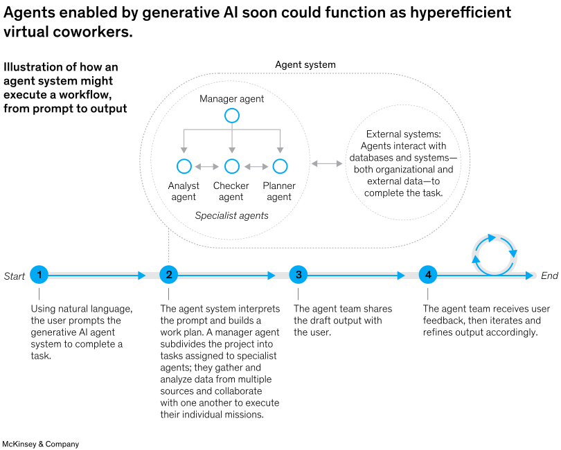
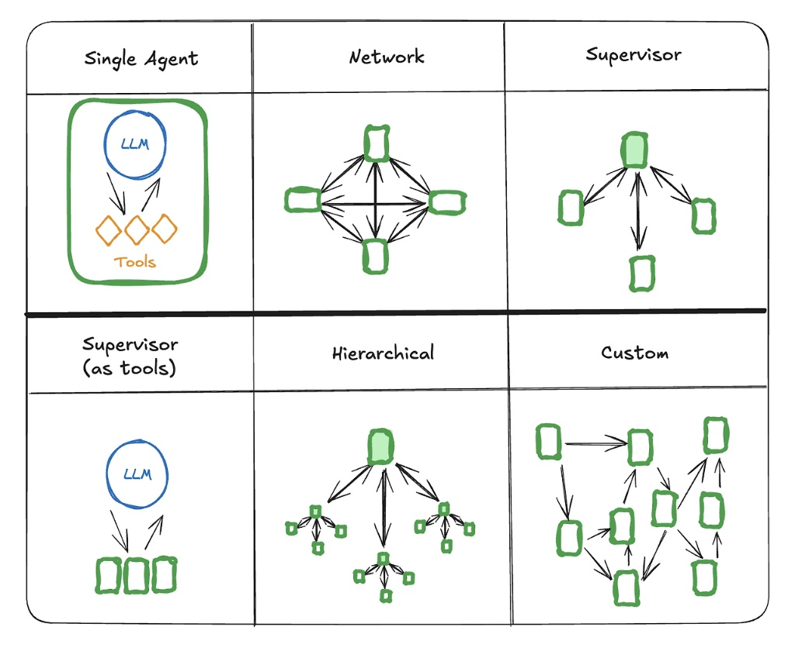
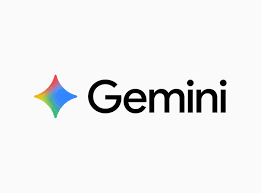
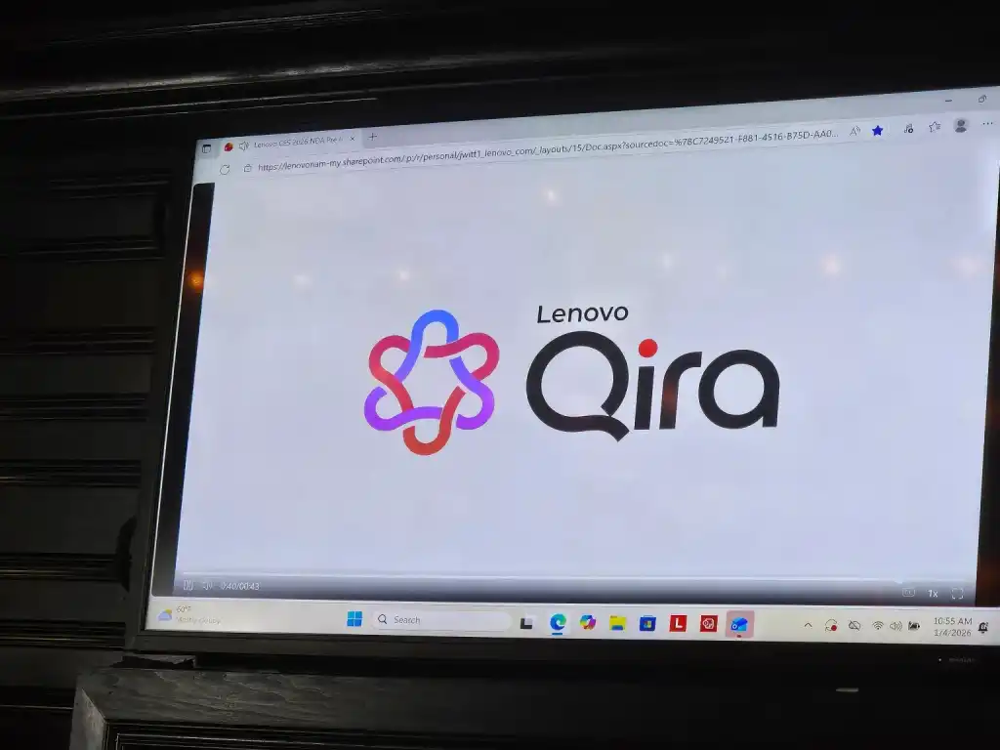

# 9주차

### 간단한 용어 정리

### RAG

- Retrieval-Augmented Generation, 검색 증강 생성
- AI가 답변을 생성할 때, 자신이 학습한 기억에만 의존하지 않고 외부 데이터베이스나 문서에서 관련 정보를 먼저 검색한 뒤 이를 바탕으로 답변을 생성하는 기술
- 거짓말(환각)을 줄임, 최신 정보를 반영

### AI Agent

- 단순한 챗봇을 넘어, 주어진 목표를 달성하기 위해 스스로 계획을 세우고, 검색이나 코드 실행 같은 도구를 사용하며 자율적으로 행동하는 AI 시스템 
→ 스스로 계획을 세우고 도구를 사용해 자율적으로 목표를 달성하는 AI

### LMM

- Large Multimodal Model
- 텍스트뿐만 아니라 시각, 청각 등 다양한 멀티모델 데이터를 처리할 수 있는 대형 AI 모델
- Foundation Model이 멀티모델 능력을 갖춘 형태

### VLM

- Vision-Language Model
- 멀티모델 중에서도 특히 이미지(Vision)와 텍스트(Language)를 연결하여 이해하는 데 특화된 모델
- 이미지를 보고 상황을 글로 묘사하거나, 텍스트를 보고 관련된 이미지를 찾아냄

### ViT

- Vision Transformer
- 자연어 처리에 혁신을 가져온 Transformer 구조를 이미지 처리에 적용한 AI 모델 아키텍처
- 이미지를 여러 개의 작은 조각(Patch)으로 나누어 처리

### MCP

- Model Context Protocol
- AI 모델이 로컬 파일, 외부 데이터베이스, API 등 다양한 데이터 소스에 안전하고 표준화된 방식으로 연결하여 정보를 읽어올 수 있도록 돕는 오픈소스 규약

### MultiModal

- 텍스트, 이미지, 오디오, 비디오 등 여러 가지 형태의 정보(모달리티)를 동시에 이해하고 처리하는 방식이나 능력

### 파인튜닝

- Fine-tuning
- 이미 똑똑하게 학습된 Foundation Model에 특정 분야(예: 법률, 의료, 특정 기업 데이터)의 데이터를 추가로 학습시켜, 목적에 맞게 모델의 성능을 미세하게 조정하는 작업

### Foundation Model

- 방대한 양의 데이터를 바탕으로 학습되어, 다양한 AI 서비스와 후속 작업의 기반이 되는 거대 범용 AI 모델
- 예: GPT-4, Gemini

### FMOps

- Foundation Model Operations
- 파운데이션 모델을 선택하고, 파인튜닝하고, 실제 서비스에 배포하고 유지보수하는 전체 수명 주기를 효율적으로 관리하는 기술 및 방법론

### Hugging Face

- AI 모델들의 'GitHub'라고 불리는 플랫폼
- 전 세계 개발자들이 머신러닝 모델, 데이터셋, 코드를 자유롭게 공유하고 다운로드하여 사용할 수 있는 거대한 커뮤니티

## AI Agent를 알아보기로 한 이유

- LMM과 VLM을 간단하게 알아보며 AI가 텍스트뿐만 아니라 이미지, 비디오처럼 다양한 데이터 형식을 이해하고 처리하는게 신기했음
- 근데 이것들은 많은 데이터를 학습해서 지식은 많지만 추론하고 행동 하는데는 한계가 있다
- 예를 들어 여행 계획을 짤 때 맛집이나 추천 경로는 잘 알려주지만 직접 처리까지 해주지는 않아서 티켓 예매나 식당 예약 같은 일처리는 사용자가 직접 해야함
- 단순히 많이 알려주는 AI를 넘어서 **스스로 계획을 세우고 도구를 사용해서 진짜 결과까지 만들어내는 AI Agent**가 매력적으로 느껴짐

## AI Agent란?

- 단순한 언어 모델(LLM)을 넘어, 스스로 생각하고 행동하는 시스템
- 기존의 AI가 질문에 대해 바로 답을 내놓는 방식이라면, AI Agent는 목표를 달성하기 위해 어떤 경로가 최적일지 스스로 생각하고, 계획을 세움
- 추론, 계획, 기억이 가능하며 일정 수준의 자율성을 갖고 의사 결정을 처리함

- 4대 핵심심 구성 요소
    - 모델(Model): 에이전트의 두뇌
    LLM(대규모 언어 모델)이 핵심 기반이 되어 **이해, 추론, 행동**을 결정함
    - 캐릭터 (Character): 역할
    모든 캐릭터는 자신만의 **역할, 성격, 커뮤니케이션 스타일**을 가짐
    - 메모리 (Memory): 지속적인 맥락 유지
    단순히 현재 대화뿐만 아니라 과거의 경험을 기억하여 더 똑똑하게 행동함
    - 도구 (Tools): 손과 발 (Action)
    에이전트가 외부 세계와 상호작용하기 위한 함수

$\text{AI Agent} = \text{LLM (두뇌)} + \text{Planning (계획)} + \text{Tools (행동 능력)}$

## AI Agent 작동 방법

- 팀장이 업무를 지시하고, 팀원들이 외부 업체와 협력해 일을 처리하는 과정과 유사함

1. 목표 설정 및 입력 (Input)
    - **사용자:** 자연어(Natural Language)로 모호하거나 복잡한 명령을 내림
    - **예시:** "이번 주말 상해 여행 일정을 짜고, 비행기 표랑 호텔도 알아봐 줘"
    - 첫 번째 단계(Start), 단순한 검색어 입력이 아니라, 목표를 부여받는 단계
    
2. 계획 및 역할 분담 (Orchestration & Planning)
    - **Manager Agent (두뇌):** 사용자의 명령을 해석하고, 이를 해결하기 위한 작업 계획을 수립함
    - **업무 세분화 (Decomposition):** 복잡한 목표를 실행 가능한 작은 단위로 쪼갬
        - "상해 여행" → ①날씨 확인  ②항공권 검색  ③호텔 검색  ④일정표 작업
    - **역할 배정:** 쪼개진 업무를 가장 잘할 수 있는 전문가 에이전트에게 분배함
        - *Analyst Agent:* 데이터 분석 담당
        - *Creative Agent:* 일정 기획 담당
        - *Planner Agent:* 예약 및 스케줄링 담당
    - 차트 중앙의 **'Agent system'** 영역, Manager Agent가 하위 에이전트들을 지휘하는 계층 구조

1. **도구 사용 및 외부 실행 (Tool Use & Action)**
    - **외부 시스템 연결:** 각 전문가 에이전트는 자신에게 필요한 외부 도구(External Systems)와 연결됨
        - API 호출 (예: 스카이스캐너 API, 구글 맵 API)
        - 사내 데이터베이스(ERP) 조회
        - 웹 검색 (Web Search)
    - **실행:** 실제로 데이터를 가져오거나, 시스템에 정보를 입력함
    - **이미지 참조:** 우측의 **'External systems'** 원, 에이전트가 외부 데이터베이스나 엔터프라이즈 툴과 상호작용하는 것을 보여줌

1. **통합 및 피드백 루프 (Synthesis & Feedback Loop)**
    - **결과 통합:** 각 에이전트가 가져온 정보(항공권 가격, 호텔 리스트, 날씨 등)를 Manager Agent가 취합하여 하나의 완성된 답변으로 만든다
    - **피드백 루프 (The Loop):** 만약 결과가 부족하거나 오류가 있다면, 혹은 사용자가 수정 요청을 하면 **다시 Step 2로 돌아가 계획을 수정함(Self-Correction)**
        - "비행기 표가 너무 비싸. 더 싼 거 찾아봐" → 다시 검색 수행
    - 마지막 단계의 **'회전하는 화살표(Loop)'** 아이콘, 한 번에 끝나는 것이 아니라 피드백을 통해 결과를 지속적으로 다듬는 과정

## AI Agent의 주요 기능

- 초기 AI Agent는 단순히 추론하고 행동하는 **ReAct(Reason+Act)** 모델에 기반
- 기술이 발전함에 따라 다음과 같은 **6가지 고도화된 기능**을 갖추게 되었음

### ① 핵심 인지 및 실행

- **추론 (Reasoning)**
    - **정의:** 확보한 정보를 바탕으로 논리적으로 생각하고 결론을 도출하는 두뇌 활동
    - **역할:** 데이터를 분석해 패턴을 찾고, 증거를 기반으로 최적의 의사결정을 내림. 단순 매칭이 아닌 '맥락(Context)'을 이해하는 것이 핵심
- **행동 (Action)**
    - **정의:** 추론된 결과를 바탕으로 실제 환경에 물리적/디지털 영향을 미치는 능력
    - **역할:**
        - **디지털:** 메시지 전송, DB 업데이트, API 호출, 프로세스 트리거
        - **물리적:** 로봇 팔 제어, 자율주행 등 (임베디드 AI의 경우)
- **관찰 (Observation)**
    - **정의:** 올바른 판단을 위해 현재 상황과 환경을 인식하는 단계
    - **기술:** 컴퓨터 비전(Vision), 자연어 처리(NLP), 각종 센서 데이터 분석을 통해 정보를 수집

### ② 고차원적 전략 및 적응

- **계획 (Planning)**
    - **정의:** 복잡한 목표를 달성하기 위해 최적의 경로를 설계하는 전략적 사고
    - **역할:** 목표를 작은 단위로 쪼개고, 미래 상태를 예측하며, 발생할 수 있는 장애물을 미리 고려하여 행동 순서를 결정
- **협업 (Collaboration)**
    - **정의:** 단독으로 해결하기 어려운 문제를 위해 다른 주체와 소통하는 능력
    - **대상:** 인간 사용자 또는 다른 AI 에이전트(Multi-Agent System)
    - **역할:** 서로의 관점을 조율하고 작업을 분담하여 공동의 목표를 달성
- **자체 조정 (Self-adjustment)**
    - **정의:** 경험과 피드백을 통해 스스로 성능을 개선하는 적응 능력
    - **역할:** 머신러닝 기법을 활용해 과거의 실수를 학습하고, 변화하는 환경에 맞춰 행동 양식을 최적화

## AI Agent와 비슷한 개념

- AI 어시스턴트
    - 자율성'보다는 '협력'에 초점을 맞춤
    - 사용자의 자연어 명령을 이해하고, 사용자를 대신해 추론하거나 작업을 수행하는 AI 제품
    - **Human-in-the-loop (인간 개입):** 사용자의 감독 하에 작동함
    - 독립적인 프로그램보다는 사용 중인 제품에 내장되어 있는 경우가 많음
    - 어시스턴트는 사용자의 요청이나 프롬프트에 응답하고 작업을 추천할 수 있지만 결정은 사용자가 하는 방식으로 어시스턴트와 사용자가 상호작용

- 봇
    - 정해진 규칙대로만 움직이는 단순 자동화 프로그램
    - AI Agent의 조상 격이지만, '지능'과 '계획' 능력이 거의 없는 형태
    - 사용자가 특정 키워드를 입력하거나 버튼을 눌러야만 반응, 수동적
    - 목표를 달성하기 위해 스스로 순서를 정하거나 추론하지 못

| **구분** | **AI 에이전트 (AI Agent)** | **AI 어시스턴트 (AI Assistant)** | **봇 (Bot)** |
| --- | --- | --- | --- |
| **목적** | 자율적이고 선제적으로 태스크 수행 | 사용자의 태스크 지원 | 간단한 태스크 또는 대화 자동화 |
| **기능** | • 복잡한 다단계 작업 수행
• 학습 및 적응
• **독립적으로 의사 결정** | • 요청 또는 프롬프트에 응답
• 정보 제공 및 간단한 태스크 수행
• 작업 추천 (결정은 **사용자**가 내림) | • **사전 정의된 규칙**을 따름
• 제한된 학습
• 기본적인 상호작용 |
| **상호작용** | 먼저 나서서 행동함, 목표 지향적 | **반응형**, 사용자 요청에 응답 | **반응형**, 트리거 또는 명령에 응답 |

## AI Agent 유형

- 기능과 환경에 따라 다양하게 나뉨
- 크게 **상호작용 방식**과 **운용되는 수**에 따라 분류됨

### ① 상호작용 기준 (Interaction-based)

사용자가 에이전트의 존재를 직접 느끼고 대화하느냐, 아니면 뒤에서 묵묵히 일하느냐에 따른 분류

- **대화형 파트너 (Conversational Partner)**
    - 표면형 에이전트 (Surface Agent)
    - **특징:** 사용자와 직접 대화를 나눔. 질문을 하거나 잡담을 나누며, 사용자에게 맞춤형 지원을 제공
    - **작동 방식:** 주로 사용자의 질문에 의해 트리거 됨
    - **활용:** 고객 서비스 봇, 의료 상담, 교육 튜터 등
- **자율 백그라운드 프로세스 (Autonomous Background Process)**
    - 백그라운드 에이전트 (Background Agent)
    - **특징:** 사용자의 직접적인 입력 없이 **백그라운드**에서 조용히 작동함. 데이터를 분석하거나 시스템을 최적화하고, 문제를 미리 발견하여 해결함
    - **작동 방식:** 사람의 개입이 거의 없으며, 특정 이벤트나 스케줄에 의해 구동됨
    - **활용:** 시스템 모니터링, 데이터 분석 리포트 생성

### ② 에이전트 수 기준 (Quantity-based)

하나의 모델로 독립적으로 해결하느냐, 아니면 여러 모델이 협력하느냐에 따른 분류

- **단일 에이전트 (Single Agent)**
    - 특정 목표를 달성하기 위해 **독립적으로** 작동하는 에이전트
    - **특징:** 하나의 파운데이션 모델(Foundation Model)을 사용하며, 외부 도구를 스스로 활용
    - **활용:** 협업이 필요 없는 명확하고 독립적인 태스크 수행 시 유리함
- **멀티 에이전트 (Multi-Agent)**
    - 멀티 에이전트 협업 구조
        - **Network (네트워크):** 모든 에이전트가 대등하게 연결되어 자유롭게 정보를 주고받는 구조, 유연한 소통이 필요한 팀 단위 작업에 적합함
        - **Supervisor (관리자 구조):** 중앙의 관리자 에이전트가 하위 에이전트들에게 일을 시키고 결과를 보고받는 수직적 구조
        - **Hierarchical (계층 구조):** 관리자 아래에 또 다른 관리자가 있는 다단계 구조, 대규모 기업의 조직도처럼 매우 복잡한 프로젝트를 수행할 때 사용
        - **Custom (커스텀):** 특정 워크플로우에 맞춰 에이전트 간의 연결을 자유롭게 설계한 형태
    
    
    

- **정의:** 공동의 목표 달성을 위해 **여러 에이전트가 협력하거나 경쟁**하는 시스템
- **특징:**
    - 각 에이전트가 서로 다른 역할과 기능을 가짐
    - 각자에게 가장 적합한 서로 다른 파운데이션 모델을 사용할 수 있음
    - 사람들 간의 소통이나 조직 행동을 시뮬레이션할 수 있음
- **활용:** 복잡한 문제 해결, 역할 분담이 필요한 대규모 프로젝트

## AI Agent 장단점

### 장점

- 더 많고 빠르게 알아서 처리함
    - **자동화:** 반복적이고 지루한 업무는 에이전트에게 맡기고, 사람은 창의적인 일에 집중할 수 있음
    - **동시 실행 (Concurrency):** 여러 에이전트가 서로 방해받지 않고 동시에 여러 업무를 병렬로 처리
- 협업 유리
    - 여러 에이전트(Multi-Agent)가 서로의 아이디어를 검토하고 비판하며 더 나은 결정을 도출
    - 자체적인 피드백 루프를 통해 추론 과정을 다듬고 실수를 줄임
- 향상된 기능
    - **도구 사용:** API, 웹 검색, 코드 실행 등 외부 도구를 사용하여 LLM의 한계를 뛰어넘음
    - **지속적 학습:** 경험을 기억하고 학습하여 시간이 지날수록 성능이 좋아

### 단점

- 부족한 공감 능력
    - AI는 데이터로 학습할 뿐, 인간의 미묘한 감정이나 사회적 분위기를 깊이 있게 이해하지 못함
    - 심리 상담, 사회복지, 갈등 해결처럼 높은 수준의 정서적 교감이 필요한 분야에는 적용하기 어려움
- 윤리적 판단의 부재
    - 데이터에 기반한 논리적 결정은 내릴 수 있지만, 선악을 구분하는 **도덕적 기준과 책임감**이 없음
- 높은 비용과 리소스
    - 고성능 에이전트를 개발하고 유지하려면 **막대한 컴퓨팅 파워(GPU)와 비용**이 든다
    - 한 작업의 복잡성에 따라 에이전트가 작업을 완료하는 데 며칠이 걸릴 수 있다

AI 에이전트는 논리적이고 반복적인 디지털 업무에는 탁월하지만, '공감', '윤리', '돌발 상황 대처'가 필요한 영역에서는 인간을 대체하기 어렵

## AI Agent를 활용한 사례

이론으로만 존재하는 것이 아니라, 실제 개발 및 서비스로 구현되고 있는 대표적인 케이스

1. 제미나이(Gemini)
    
    
    
- 구글의 **제미나이(Gemini) AI 에이전트**는 단순한 챗봇이 아닌, 스스로 생각하고 계획하며 복잡한 다단계 작업을 수행하는 '능동적 에이전트(Agentic AI)'로 발전함
- 단순한 정보 제공을 넘어, 검색·도구 연동을 통해 실질적인 업무를 수행하는 범용 AI 에이전트

**주요 기능:**

- **개인 비서:** 일정 관리, 식당/항공권 예약, 자료 조사 등 반복적인 업무를 자동화하여 처리
    - 제미나이는 Google 확장 프로그램을 통해 구글 지도, 유튜브, 호텔/항공권 검색, 워크스페이스(Drive, Docs)와 연결되어 있음
    - *예:* "내 구글 드라이브에서 '여행 계획' 문서 찾아서 요약해 주고, 그 날짜에 맞는 비행기 표 찾아줘"라고 하면 **스스로 도구를 선택해 실행**
- **코딩 에이전트:** 코드 작성부터 디버깅, API 통합까지 전체 소프트웨어 개발 수명 주기(SDLC)를 지원
- **데이터 분석:** SQL 지식이 없어도 자연어로 BigQuery 데이터를 분석하고 인사이트 리포트를 생성함
- **에이전트 비전:** 이미지를 단순히 분류하는 것을 넘어, 시각 정보를 해석하고 이를 바탕으로 작업을 수행함(LMM 능력)

1. Lenovo (레노버)

**1. 실무 도입 성과 (Performance)**

- **도입 분야:** 소프트웨어 엔지니어링 및 고객 지원
- **주요 성과:** 개발자 생산성 **15% 향상**, 고객 응대 시간 **두 자릿수 단축**
- **의의:** 실험 단계를 넘어 대기업 현장에서 실제 **투자 대비 효과(ROI)와 생산성**을 입증함

**2. 차세대 기술: '키라(Qira)' (CES 2026 공개)**

- **정의:** PC, 스마트폰 등 기기 간 경계 없이 작동하는 **'크로스 디바이스 슈퍼 에이전트'**
- **특징:**
    - **연결성:** 백그라운드에서 정보를 결합해 업무와 창작을 끊김 없이 지원
    - **보안:** 사용자가 활성화할 때만 데이터를 처리하는 **'사용자 주도형 프라이버시'** 적용

**3. 미래 비전 (Vision)**

- **목표:** 단순 보조(가상 비서)를 넘어, 인간을 대신해 임무를 완수하는 '완전 자율 대리인'으로 진화
- **에이전트 네이티브:** **프로젝트 큐빗**(엣지 클라우드), **프로젝트 맥스웰**(웨어러블) 등 다양한 하드웨어로 에이전트 생태계 확장